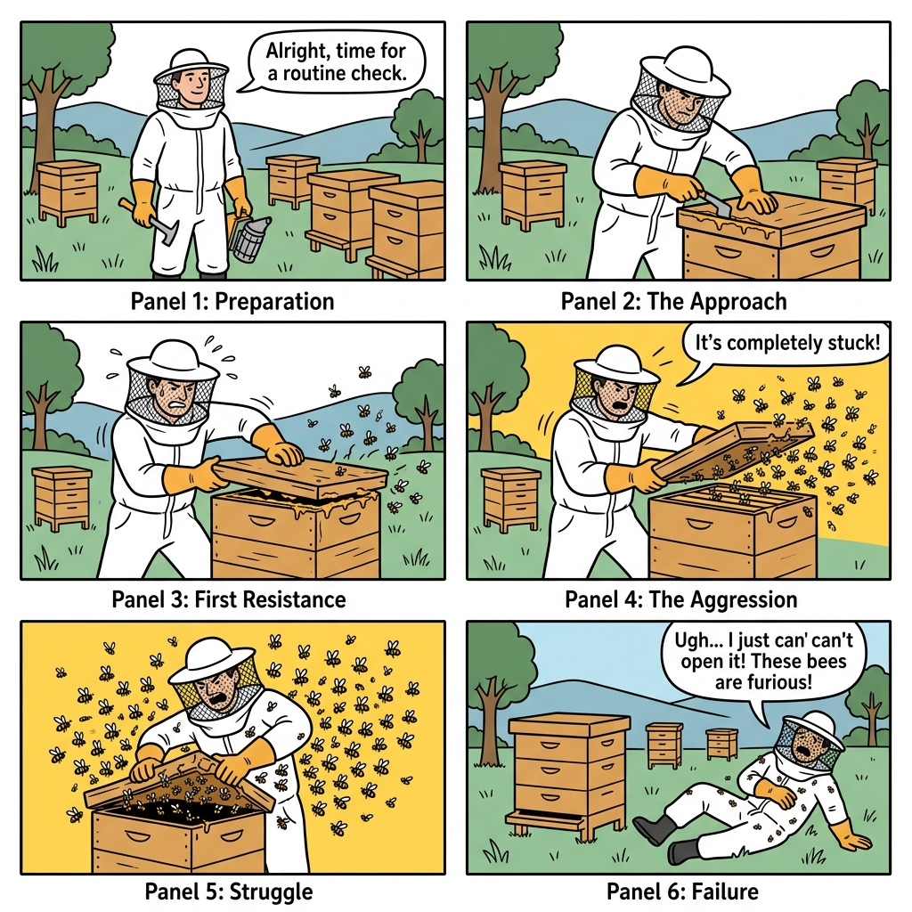
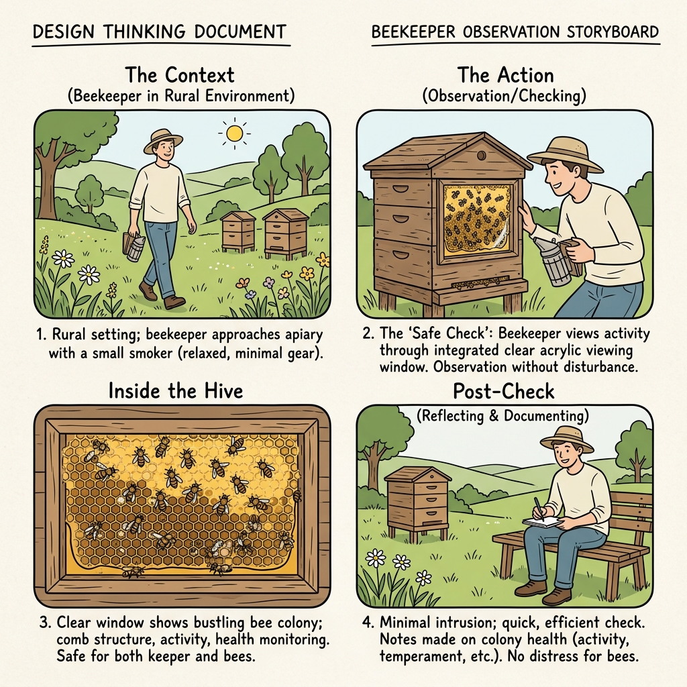
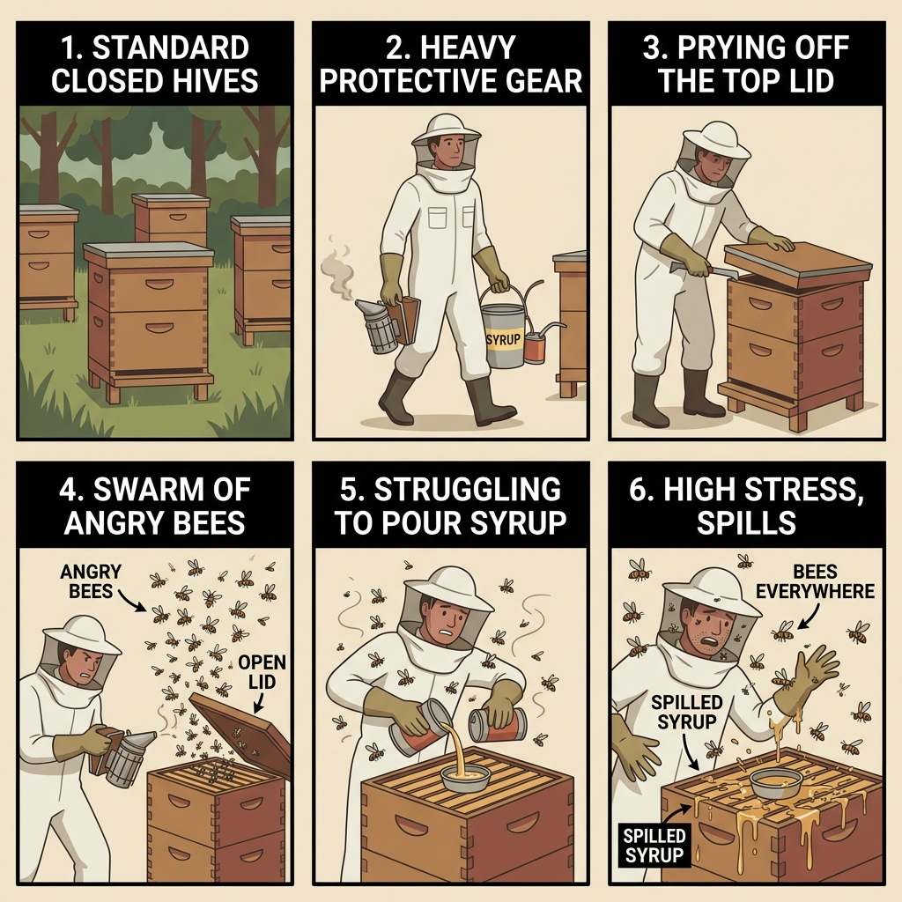
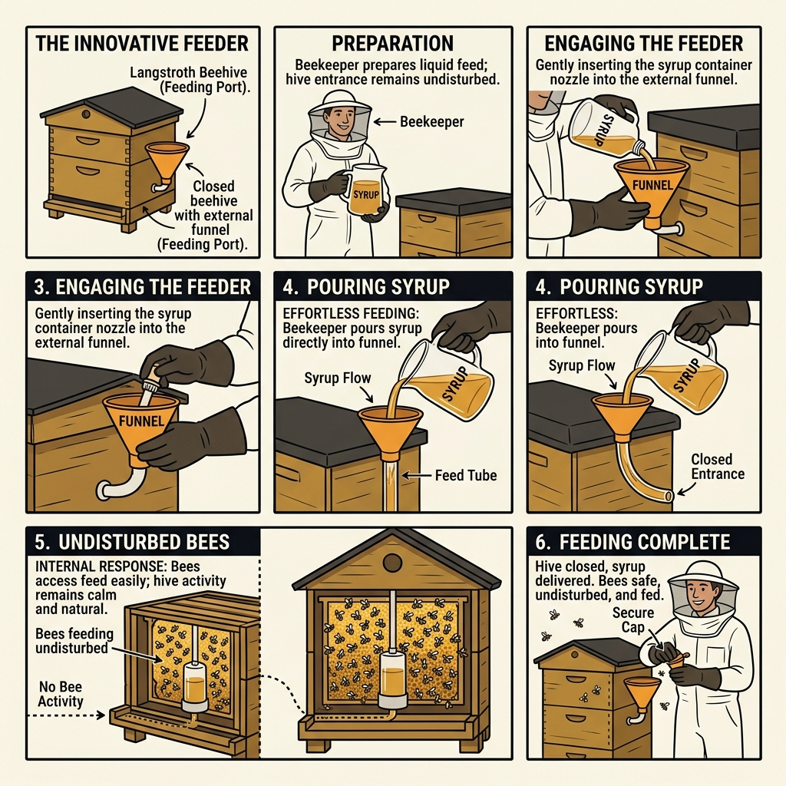
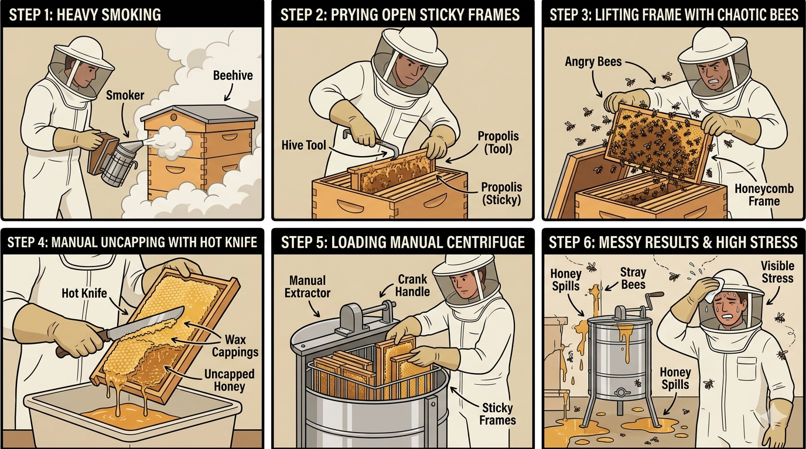
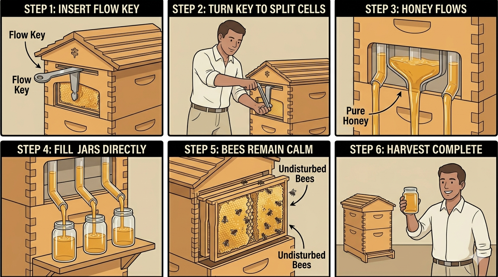

# 05 - Storyboarding: The Beekeeper's Journey (Before & After)

This storyboard visualizes the journey of a small-scale beekeeper facing the critical challenges of hive maintenance: **inspection, feeding, and harvesting**. It highlights the transformation from traditional, high-risk processes to our non-intrusive upgrades.

---

# PART 1: VISUAL INSPECTION

## Panel 1: BEFORE THE UPGRADE (The Pain Point)

*   **Action:** Beekeeper must wear heavy protective gear and lift the wooden lid to check on the colony's health.
*   **Experience:** Opening the hive agitates the bees, causing them to swarm.
*   **Result:** High fear of stings, disruption of the internal hive temperature, and significant time wasted putting on protective gear.

---

## Panel 2: AFTER THE UPGRADE (The Solution)

*   **Action:** Beekeeper visually inspects the hive safely through the clear side window.
*   **Experience:** The bees continue working inside, completely unaware of the inspection.
*   **Result:** Zero stings, zero disruption to the micro-climate, and instant checks without needing a protective suit.

---

# PART 3: HIVE FEEDING

## Panel 3: BEFORE THE UPGRADE (The Pain Point)

*   **Action:** Beekeeper must open the hive to place sugar syrup inside during dry seasons.
*   **Experience:** The bees become defensive and attack. The beekeeper struggles to pour the syrup without drowning bees.
*   **Result:** High stress, high risk of stings, and bees drowning in the feed.

---

## Panel 4: AFTER THE UPGRADE (The Solution)

*   **Action:** Beekeeper feeds the bees in normal clothing with zero protective gear.
*   **Experience:** Pouring syrup directly into the external funnel. The syrup flows safely inside through a gravity pipe.
*   **Result:** The hive lid remains closed. The colony is quiet and undisturbed.

---

# PART 4: HONEY HARVESTING

## Panel 5: BEFORE THE UPGRADE (Traditional Harvesting)

*   **Action:** Beekeeper uses heavy smoke, pulls out sticky honeycombs, uncaps wax cells with a hot knife, and spins them in a centrifuge extractor.
*   **Experience:** Bees are highly agitated and crushed in the process. Sticky honey spills everywhere.
*   **Result:** Very labor-intensive, high bee mortality, messy cleanup, and requires expensive extraction equipment.

---

## Panel 6: AFTER THE UPGRADE (Auto-Harvest Flow)

*   **Action:** Beekeeper inserts a harvesting key at the top of the frame and turns it.
*   **Experience:** The internal matrix splits, allowing honey to drain out of the back tube via gravity directly into clean jars.
*   **Result:** The hive remains closed, bees are completely undisturbed on the comb surface, and pure honey is harvested with zero mess.
